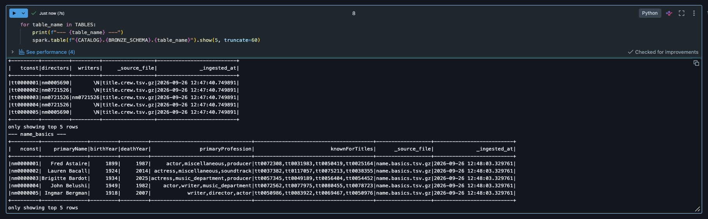
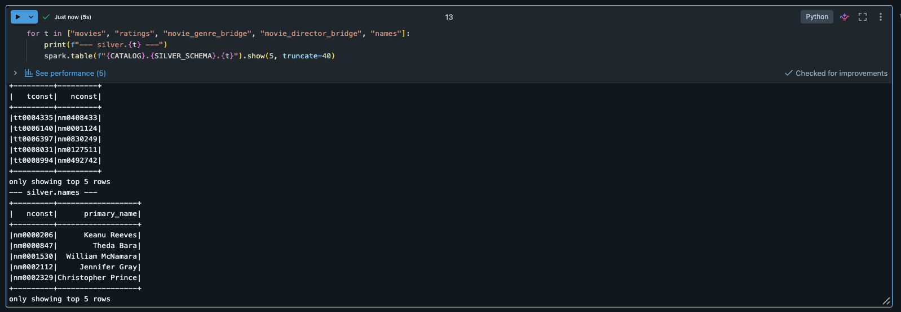
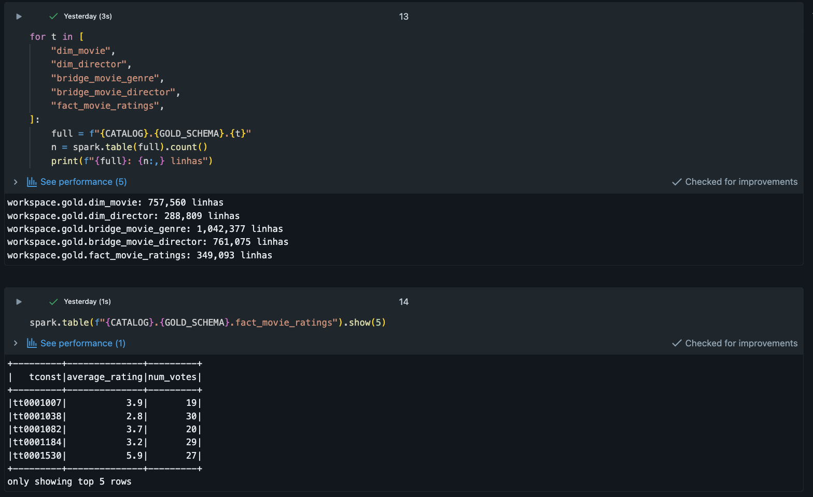

# Pedro de Carvalho Júnior - *Sprint Engenharia de Dados.* 

Ciência de Dados e Analytics

# MVP — Fatores associados à avaliação de filmes no IMDb

Pipeline de dados de ponta a ponta construído no **Databricks**, usando os **IMDb Non-Commercial Datasets** como fonte. Este README segue a estrutura exigida pela especificação do trabalho (um bloco por etapa).

## 1. Contexto de Negócio e Perguntas (Etapa 2 e 4.1)

### Problema

Streamings e distribuidoras precisam decidir onde investir marketing e catálogo. Uma pergunta recorrente da área de conteúdo é: **o que, nos dados públicos de um filme, está associado a notas mais altas do público?** Este MVP constrói um pipeline que organiza os dados públicos do IMDb para investigar essa pergunta.

**Problema central:** Quais características de um filme — gênero, duração, diretor e época de lançamento — estão associadas a uma nota média (averageRating) mais alta no IMDb?

### Perguntas de negócio

1.  Existe relação entre o(s) gênero(s) de um filme e sua nota média?

2.  Filmes com duração (runtimeMinutes) maior tendem a ter notas mais altas ou mais baixas?

3.  Diretores com mais filmes dirigidos têm nota média mais alta e mais consistente do que diretores com poucos filmes?

4.  Como a nota média dos filmes evoluiu ao longo das décadas de lançamento?

5.  Existe relação entre o número de votos (numVotes, proxy de popularidade/alcance) e a nota média?

### Fonte de dados e licença

**IMDb Non-Commercial Datasets** — [<u>https://datasets.imdbws.com/</u>](https://datasets.imdbws.com/) (documentação: [<u>https://developer.imdb.com/non-commercial-datasets/</u>](https://developer.imdb.com/non-commercial-datasets/))

Arquivos utilizados:

| **Arquivo**          | **Conteúdo**                     | **Colunas relevantes**                                             |
|----------------------|----------------------------------|--------------------------------------------------------------------|
| title.basics.tsv.gz  | Metadados de cada título         | tconst, titleType, primaryTitle, startYear, runtimeMinutes, genres |
| title.ratings.tsv.gz | Notas e votos                    | tconst, averageRating, numVotes                                    |
| title.crew.tsv.gz    | Diretores/roteiristas por título | tconst, directors                                                  |
| name.basics.tsv.gz   | Nome das pessoas                 | nconst, primaryName                                                |

**Licença:** dados disponibilizados gratuitamente pela IMDb **exclusivamente para uso pessoal e não comercial**, mediante atribuição à IMDb como fonte (termos completos em developer.imdb.com/non-commercial-datasets). Este trabalho é acadêmico e não comercial, portanto está dentro dos termos de uso. Nenhum dado bruto do IMDb é redistribuído neste repositório — apenas o código do pipeline.

### Resumo da estrutura dos dados brutos

- title.basics: ~11M+ linhas, granularidade = 1 título (filme, série, episódio etc). Este trabalho filtra apenas titleType = 'movie'.

- title.ratings: 1 linha por título com nota agregada, atualizada diariamente pela IMDb.

- title.crew: 1 linha por título, coluna directors traz uma lista de nconst separada por vírgula (relação N:N entre filme e diretor).

- name.basics: 1 linha por pessoa (ator, diretor etc.), usada para resolver nconst → nome do diretor.

## 2. Carga dos Dados (Etapa 4.2)

- Camada **Bronze**: download direto dos .tsv.gz oficiais para um Volume do Unity Catalog, sem nenhuma transformação, e leitura para tabelas Delta "como vieram" (mantendo \N como string e todas as colunas como string), com metadados de controle (\_ingested_at, \_source_file).

- Script: [<u>notebooks/01_ingestao_dados_brutos.py</u>](http://notebooks/01_ingestao_dados_brutos.py)

- Link do notebook publicado / commit no GitHub: https://github.com/pedrocarvalhosu-puc/IMDB_analise

- Screenshot da execução e das tabelas Bronze criadas no catálogo.

- 

## 3. Modelagem e Catálogo de Dados (Etapa 4.3)

Modelo **Esquema Estrela**: um fato de avaliações e três dimensões (filme, diretor, gênero), usando tabelas-ponte para as relações N:N (filme↔gênero, filme↔diretor).

dim_movie ──┐

├── fact_movie_ratings (tconst, averageRating, numVotes)

dim_director┘

│

bridge_movie_genre (tconst, genre)

bridge_movie_director (tconst, nconst)

### Catálogo de dados

**gold.dim_movie**

| **Coluna**      | **Tipo** | **Descrição**                                | **Domínio**                |
|-----------------|----------|----------------------------------------------|----------------------------|
| tconst          | string   | Chave do título no IMDb (PK)                 | ex: tt0111161              |
| primary_title   | string   | Título do filme                              | texto livre                |
| start_year      | int      | Ano de lançamento                            | 1874–ano atual             |
| decade          | int      | Década de lançamento, derivada de start_year | ex: 1990, 2000             |
| runtime_minutes | int      | Duração em minutos                           | 1–800 (filtrado na Silver) |

**gold.dim_director**

| **Coluna**   | **Tipo** | **Descrição**                | **Domínio**   |
|--------------|----------|------------------------------|---------------|
| nconst       | string   | Chave da pessoa no IMDb (PK) | ex: nm0000233 |
| primary_name | string   | Nome do diretor              | texto livre   |

**gold.fact_movie_ratings**

| **Coluna**     | **Tipo** | **Descrição**         | **Domínio** |
|----------------|----------|-----------------------|-------------|
| tconst         | string   | FK → dim_movie        | —           |
| average_rating | double   | Nota média (0–10)     | 0.0–10.0    |
| num_votes      | int      | Nº de votos recebidos | ≥ 0         |

**gold.bridge_movie_genre** — tconst (FK), genre (string, ex: Drama, Comedy)

**gold.bridge_movie_director** — tconst (FK), nconst (FK)

**Linhagem:** todas as tabelas Gold derivam das tabelas Silver homônimas (mesmo nome sem o prefixo), que por sua vez derivam das tabelas Bronze title_basics, title_ratings, title_crew, name_basics — ver notebooks/02_limpeza_dados_tratados.py e notebooks/03_modelagem_dados_analiticos.py para o detalhamento de cada transformação.

- Screenshot do Unity Catalog mostrando os schemas bronze / silver / gold.

- 

## 4. Pipeline de Dados (Etapa 4.4)

O pipeline foi dividido em **um notebook por camada** (Bronze → Silver → Gold), executados em sequência, para manter cada etapa curta e fácil de depurar/re-executar isoladamente:

1.  [<u>notebooks/01_ingestao_dados_brutos.py</u>](http://notebooks/01_ingestao_dados_brutos.py) — Extract: baixa os 4 arquivos oficiais do IMDb e grava como Delta, sem transformação.

2.  [<u>notebooks/02_limpeza_dados_tratados.py</u>](http://notebooks/02_limpeza_dados_tratados.py) — Transform: filtra titleType = 'movie', corrige tipos, trata nulos (\N), remove duplicatas, explode genres e directors em tabelas-ponte.

3.  [<u>notebooks/03_modelagem_dados_analiticos.py</u>](http://notebooks/03_modelagem_dados_analiticos.py) — Load: monta o esquema estrela final (dim_movie, dim_director, bridge_movie_genre, bridge_movie_director, fact_movie_ratings), pronto para consumo analítico.

Cada transformação relevante está documentada em comentários no próprio notebook (o quê foi feito, por que, e o impacto nos dados).

- Link dos notebooks no GitHub / Databricks Repos: https://github.com/pedrocarvalhosu-puc/IMDB_analise

- Screenshots confirmando que as tabelas Silver e Gold foram persistidas no Databricks (aba Catalog).

- 

## 5. Qualidade de Dados (Etapa 4.5)

Checagens feitas em [<u>notebooks/04_qualidade_dos_dados.py</u>](http://notebooks/04_qualidade_dos_dados.py) sobre a camada Bronze/Silver, cobrindo:

- **Completude:** % de nulos em runtimeMinutes, genres, directors, averageRating.

- **Consistência:** startYear dentro de um intervalo plausível (1874–ano atual + 1); genres pertencentes a uma lista fechada de gêneros conhecidos do IMDb.

- **Unicidade:** duplicatas de tconst em title.basics / title.ratings.

- **Acurácia:** averageRating fora do intervalo \[0, 10\]; runtimeMinutes com valores absurdos (ex: \> 800 minutos).

- **Outliers:** filmes com numVotes extremamente alto/baixo via IQR, para decidir se entram nas agregações da análise (ver notebook de análise).

Completude (% de nulos/\N em title.basics): startYear 14,99% ausente; runtimeMinutes 35,82% ausente; genres 10,29% ausente. Tratamento: como runtimeMinutes tem mais de um terço de ausência, os filmes sem essa informação foram mantidos na Silver, mas excluídos apenas da pergunta 2 (duração x nota), para não reduzir a amostra das demais análises. Unicidade: 0 tconst duplicados em title.basics (filmes) e 0 em title.ratings — não havia duplicatas a tratar. Consistência: 137 filmes com startYear fora do intervalo plausível \[1874, 2027\]; esses registros foram descartados na camada Silver, pois não é possível confiar no ano de lançamento informado. Acurácia: 0 notas (averageRating) fora do intervalo \[0, 10\]; 63 filmes com runtimeMinutes fora de \[1, 800\] minutos, tratados na camada Silver. Outliers: usando IQR sobre numVotes (Q1=12, Q3=98, limites=\[-117, 227\]), 273.808 títulos (de title.ratings completo, todos os tipos, não só filmes) ficam fora desse intervalo. Esse número alto não indica erro nos dados: numVotes segue uma distribuição extremamente assimétrica (poucos títulos populares concentram a maioria dos votos, enquanto a maioria dos títulos tem poucos votos), então o método de IQR clássico marca como "outlier" qualquer título minimamente popular. Por isso, esses registros não foram removidos da análise — a decisão foi usar faixas de popularidade (buckets), como na pergunta 5, em vez de excluir esses títulos como se fossem erro. Checagem adicional já na camada Gold (pós-tratamento): 0 filmes com start_year fora do intervalo, 0 notas fora de \[0,10\] e 0 tconst duplicados em dim_movie — confirma que os problemas encontrados na Bronze foram corrigidos ao longo do pipeline.

## 6. Análise de Dados (Etapa 4.5)

Consultas em [<u>notebooks/05_analise_perguntas_negocio.py</u>](http://notebooks/05_analise_perguntas_negocio.py), uma seção por pergunta de negócio (ver Seção 1). Para cada pergunta: consulta SQL/PySpark, resultado e discussão.

**Pergunta 1 — Gênero x nota média: existe relação entre o(s) gênero(s) de um filme e sua nota média?**

*Resultado: nota média por gênero (top e bottom da lista, n de filmes): Documentary 7,19 (n=2.574); Biography 6,9 (n=2.604); Film-Noir 6,85 (n=463); History 6,82 (n=1.937); War 6,77 (n=1.231); Music 6,7 (n=1.489); Animation 6,63 (n=1.627); Musical 6,58 (n=854); Sport 6,53 (n=922); Drama 6,49 (n=27.381); Western 6,39 (n=665); Romance 6,39 (n=8.172); Crime 6,3 (n=8.186); Family 6,22 (n=2.061); Comedy 6,15 (n=16.353); Adventure 6,1 (n=5.318); Mystery 5,98 (n=4.173); Fantasy 5,94 (n=2.659).*

Sim, existe relação clara entre gênero e nota média. Gêneros não-ficcionais/mais “autorais” (Documentary 7,19, Biography 6,9, Film-Noir 6,85, History 6,82, War 6,77) ficam bem acima da média geral, enquanto gêneros de entretenimento de massa (Fantasy 5,94, Mystery 5,98, Adventure 6,1, Comedy 6,15) ficam abaixo. Duas ressalvas importantes: (1) um filme pode ter vários gêneros ao mesmo tempo (relação N:N via bridge_movie_genre), então o mesmo título entra em mais de um grupo; (2) gêneros de nicho como Documentary tendem a atrair um público mais engajado/seletivo (quem assiste já tem interesse no tema), o que pode inflar a nota média em comparação com gêneros de consumo mais amplo, que recebem avaliações de um público mais heterogêneo.

**Pergunta 2 — Duração x nota média: filmes com duração (runtimeMinutes) maior tendem a ter notas mais altas ou mais baixas?**

*Resultado: correlação linear (Pearson) runtime x rating: 0,252 (positiva, mas fraca/moderada). Por faixa de duração: \<60 min: 6,52 (n=263); 60–89 min: 5,81 (n=9.660); 90–119 min: 6,2 (n=29.015); 120–149 min: 6,69 (n=7.664); 150+ min: 6,82 (n=2.542).*

Há uma tendência de filmes mais longos terem nota um pouco mais alta — a correlação é positiva (0,252) e as faixas confirmam o padrão geral, com 150+ min na nota mais alta (6,82) e 60–89 min na mais baixa (5,81, com amostra grande, n=9.660). A faixa \<60 min foge um pouco do padrão (6,52, mas amostra pequena, n=263). Uma leitura plausível é que filmes de 60–89 minutos concentram muita produção de baixo orçamento/B-movies, enquanto filmes de 120+ minutos costumam ser produções de estúdio maiores, com mais recursos e revisão de roteiro. Ainda assim, a correlação de 0,25 é fraca: duração sozinha explica pouco da variação na nota, outros fatores (gênero, diretor) pesam mais.

**Pergunta 3 — Diretores recorrentes x nota: diretores com mais filmes dirigidos têm nota média mais alta e mais consistente do que diretores com poucos filmes?**

*Resultado: diretores com \>= 5 filmes: média das médias = 6,35, média do desvio-padrão = 0,70, n=2.560 diretores. Diretores com \< 5 filmes: média das médias = 6,05, média do desvio-padrão = 0,62, n=20.508 diretores. Top do ranking (\>=5 filmes): Park Jun-soo (8 filmes, 8,36, desvio 0,12), Humayun Ahmed (5, 8,28, 0,61), Haruo Sotozaki (8, 8,19, 0,46), Lee Unkrich (5, 8,18, 0,19), Christopher Nolan (13, 8,18, 0,59), entre outros.*

Diretores mais prolíficos (\>=5 filmes) têm nota média mais alta (6,35 vs 6,05) — plausível, já que diretores que continuam sendo contratados/financiados para fazer mais filmes tendem a ser justamente os que têm histórico de boa recepção (um efeito de reputação/sobrevivência no mercado). Já a hipótese de que eles são mais “consistentes” não se confirma: o desvio-padrão médio dos prolíficos (0,70) é levemente maior que o dos ocasionais (0,62), ou seja, no agregado eles não são mais regulares. Individualmente, porém, há bastante variação dentro do próprio grupo de destaque — diretores como Park Jun-soo (desvio 0,12) ou Lee Unkrich (0,19) são extremamente consistentes, enquanto outros com média alta, como Vijay K. Bhaskar (desvio 1,08), oscilam bastante entre um filme e outro.

**Pergunta 4 — Nota média por década: como a nota média dos filmes evoluiu ao longo das décadas de lançamento?**

*Resultado: nota média por década (n de filmes): 1900: 6,0 (n=1); 1910: 6,67 (n=57); 1920: 7,03 (n=242); 1930: 6,79 (n=814); 1940: 6,8 (n=1.141); 1950: 6,65 (n=1.625); 1960: 6,61 (n=2.029); 1970: 6,46 (n=2.621); 1980: 6,27 (n=3.374); 1990: 6,33 (n=4.338); 2000: 6,2 (n=8.470); 2010: 6,07 (n=14.524); 2020: 6,1 (n=9.908).*

As décadas anteriores a 1930 têm amostra muito pequena (1 a 242 filmes) e alta variância, então a nota alta dessas décadas (ex: 7,03 nos anos 1920) não é conclusiva. A partir de 1930, com amostras robustas (800+ filmes por década), há uma tendência clara de queda na nota média: de ~6,8 nos anos 1930–40 para ~6,1 nos anos 2010–20. Ao mesmo tempo, o volume de filmes catalogados cresce exponencialmente (de 814 para mais de 14 mil por década). A leitura mais provável, conectando com a pergunta 5, é que o crescimento do catálogo do IMDb passou a incluir cada vez mais produções de nicho/menor orçamento e visibilidade, que tendem a receber notas mais medianas — puxando a média geral para baixo mesmo sem os clássicos ficarem “piores”.

**Pergunta 5 — Nº de votos x nota média: existe relação entre o número de votos (numVotes, proxy de popularidade/alcance) e a nota média?**

*Resultado: correlação de Pearson entre log(1+num_votes) e averageRating: -0,077 (praticamente nula). Porém, agrupando por faixa de popularidade: \<1k votos: nota média 6,14 (n=299.949); 1k–10k votos: 6,11 (n=36.546); 10k–100k votos: 6,47 (n=9.846); 100k+ votos: 6,99 (n=2.752).*

A correlação linear quase nula é enganosa aqui: mais de 85% dos filmes têm menos de mil votos (299.949 de ~349 mil), o que domina o cálculo e mascara o padrão real. Olhando as médias por faixa, fica claro que filmes muito votados (100k+) têm nota média bem mais alta (6,99) do que os pouco votados (6,11–6,14). Isso faz sentido: um filme só acumula dezenas ou centenas de milhares de votos se sustentar interesse/qualidade ao longo do tempo, enquanto a maioria dos títulos obscuros ou mal avaliados nunca passa de poucas centenas de votos. Ou seja, popularidade (numVotes) está associada a nota mais alta, mas essa relação só aparece quando se olha por faixas, não pela correlação linear simples — um cuidado metodológico importante para reportar.

### Conclusão

A conclusão da análise é que nota alta no IMDb não está associada simplesmente a “filme popular” de forma simples, mas sim há sinais de engajamento sustentado e produção mais cuidada, não há características superficiais de entretenimento de massa. Gêneros de nicho/prestígio (documentário, biografia, guerra) pontuam mais alto, provavelmente porque atraem um público mais seletivo e engajado (pergunta 1). Filmes mais longos tendem a notas levemente melhores, possivelmente por indicarem produções de maior orçamento/cuidado com roteiro, embora a diferença seja modesta. Diretores que produzem mais filmes têm nota média mais alta — o que pode ser ocasionado pelo efeito de reputação: quem continua sendo financiado para dirigir tende a ser quem já entregou resultado antes — mas não são necessariamente mais consistentes. Isso porque deve-se considerar que nem todos os projetos são autorais, muitos diretores por sua fama, acabam aderindo a projetos comerciais, que deixam de lado narrativas complexas e priorizam o estilo e a estética, essa teoria pode ser complementada pela questão do aumento das produções ao longo dos anos, com a globalização, mais estúdios e produções são criados, mas o que não reflete organicamente na qualidade das produções em si. A queda na nota média ao longo das décadas não indica que os filmes pioraram, e sim que o catálogo do IMDb passou a incluir cada vez mais produções de nicho e menor visibilidade, o que dilui a média geral — e essa leitura se conecta diretamente com a pergunta 5: filmes com muitos votos (alta popularidade/alcance sustentado) têm nota bem mais alta que os pouco votados, um padrão que só aparece quando se olha por faixas, não pela correlação linear simples. Para a pergunta de negócio original (o que associar a marketing/catálogo de streamings), a conclusão prática é que nota alta no IMDb tende a acompanhar filmes com legado/engajamento de público ao longo do tempo (votos, diretor recorrente, gênero de prestígio) mais do que características fixas do produto em si.

Uma ressalva importante: todas essas são associações, não relações de causa e efeito — há efeitos de autosseleção de público (quem assiste documentário já gosta do tema) e de sobrevivência no mercado (diretor só continua filmando se teve sucesso antes) que confundem a leitura causal e deveriam ser consideradas antes de qualquer decisão de investimento baseada só nesses dados. Screenshots dos resultados de cada pergunta estão no notebook notebooks/05_analise_perguntas_negocio.py.

## 7. Autoavaliação

Os objetivos definidos na seção 1 foram parcialmente respondidos, acredito que alguns dos resultados podem ajudar a entender o cenário do cinema, mas que todas as análises podem ser aprofundadas visando um melhor aproveitamento destas bases. Por exemplo, a maior nota média nas avaliações para documentários, não significa que este gênero necessariamente vá render mais resultados por conta do seu público mais nichado, entretanto, pode se tornar um ótimo custo benefício quando comparado À grandes produções, o valor médio do investimento poderia entrar numa próxima análise comparativa ao invés de uma avaliação de qualidade abstrata como notas e avaliação.

A principal dificuldade é elaborar hipóteses, exige um processo de entendimento dos temas abordados e criatividade para que não sejam perguntas óbvias que não necessitem de uma análise de dados para que sejam respondidas.

Outra dificuldade , principalmente pra mim que sou da área da comunicação, é estruturar o mapa mental do pipeline para que ele possa ter a estrutura necessária pra responder as hipóteses sem que dados outliers influenciem no resultado final, então houveram momentos que tive que recorrer ao auxílio de IA para melhor entender como eu construiria isso de um jeito mais eficaz.

Numa próxima análise, eu usaria referenciais de sucesso pra poder identificar relações a partir de cases de sucesso pra encontrar modelos que fossem mais assertivos para responder os objetivos definidos.

## Estrutura do repositório

.

├── README.md

└── notebooks/

├── 01_ingestao_dados_brutos.py

├── 02_limpeza_dados_tratados.py

├── 03_modelagem_dados_analiticos.py

├── 04_qualidade_dos_dados.py

└── 05_analise_perguntas_negocio.py

Cada .py está no formato de **Databricks notebook** (# Databricks notebook source + \# COMMAND ----------) — pode ser importado diretamente no Databricks (File → Import) ou sincronizado via **Databricks Repos** conectado a este repositório GitHub.
